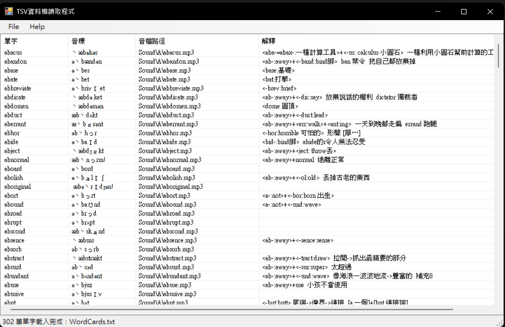

# TSV資料檔讀取程式

本專案為「資料檔讀取與自訂類別集合」上課練習，使用 C# Windows Forms 製作 TSV / TXT 資料檔讀取程式。

## 功能簡介

- 使用 `OpenFileDialog` 開啟 `.tsv` 或 `.txt` 資料檔。
- 使用 `WordItem` 類別表示單筆單字資料。
- 使用 `WordCollection` 自訂類別集合管理所有單字資料。
- 將資料顯示於 `ListView`，欄位包含：單字、音標、音檔路徑、解釋。
- 提供 `File > Open`、`File > Exit`、`Help > About` 功能表。
- 狀態列顯示目前操作訊息與載入筆數。

## 執行方式

1. 使用 Visual Studio 開啟 `TSVFile.sln`。
2. 確認目標框架為 `.NET Framework 4.8`。
3. 按下 `F5` 執行程式。
4. 點選 `File > Open`，選擇專案內的 `WordCards.txt`。
5. 程式會將 TSV 資料讀入並顯示在表格中。

## 執行畫面截圖



## 專案結構

```text
TSVFile/
├── Program.cs
├── frmTSVFile.cs
├── frmTSVFile.Designer.cs
├── frmAbout.cs
├── frmAbout.Designer.cs
├── WordItem.cs
├── WordCollection.cs
├── WordCards.txt
├── WordCards.ico
├── WordCards_Logo.png
├── README.md
├── .gitignore
└── TSVFile.csproj
```

## GitHub 上傳注意事項

本專案已加入 `.gitignore`，請不要上傳以下編譯或暫存資料夾：

- `bin/`
- `obj/`
- `.vs/`
- `.git/`


## 作者

- 學號：1121427
- 姓名：石秉璿
